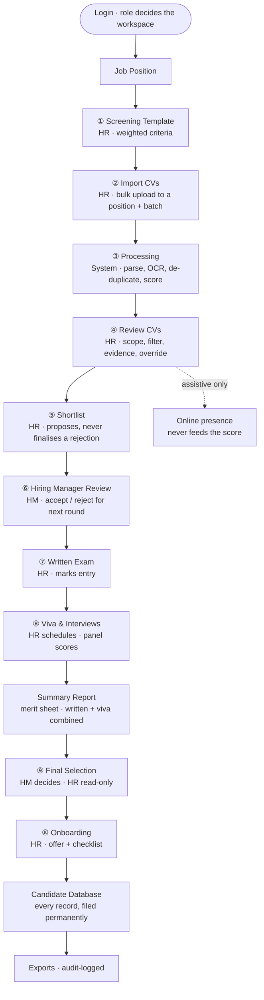

# STL AI-Powered ATS — Clickable Prototype

An **Applicant Tracking System with AI-assisted CV screening** for **Square Toiletries Limited (STL)** — built so HR can take 5,000+ CVs per batch down to a defensible shortlist without ever letting the machine make the rejection.

This repository holds the **working prototype**: 41 interlinked pages, four roles, and the complete hiring cycle from job position to onboarding. Pure HTML + CSS + inline SVG + vanilla JavaScript — **no build step, no dependencies, no server**. Open a file and it runs.

> **Design:** Variation A "Clarity" · Square corporate blue `#0B61C2`
> **Backend (decided, not yet built):** NestJS 10 · PostgreSQL · TypeORM · Redis

---

## Table of contents

1. [Live prototype](#1-live-prototype)
2. [The one-minute tour](#2-the-one-minute-tour)
3. [Roles — who can do what](#3-roles--who-can-do-what)
4. [The hiring flow, stage by stage](#4-the-hiring-flow-stage-by-stage)
5. [How decisions are made](#5-how-decisions-are-made)
6. [Where the data lives](#6-where-the-data-lives)
7. [The four non-negotiable principles](#7-the-four-non-negotiable-principles)
8. [Page inventory](#8-page-inventory)
9. [Repo layout](#9-repo-layout)
10. [Hosting on GitHub Pages](#10-hosting-on-github-pages)
11. [Design system](#11-design-system)
12. [How this prototype is verified](#12-how-this-prototype-is-verified)
13. [What is real vs. simulated](#13-what-is-real-vs-simulated)

---

## 1. Live prototype

```
https://sadiasajarun.github.io/Square_ATS/
```

The root redirects to the **login page**, which is the front door of the whole prototype. From there you enter any of the four roles and walk the full cycle. **Sign out** is available on every page.

To run it locally instead, open `docs/index.html` in a browser. Nothing to install.

---

## 2. The one-minute tour

If you have sixty seconds and want to see the point of the product:

| # | Click | What you're looking at |
|:-:|-------|------------------------|
| 1 | **Login → HR** | The primary workspace. Everything operational happens here. |
| 2 | Sidebar → **4 Review CVs** | Pick a **position** and **batch**, then click any bar on a chart — score band, missing skill, red flag, district. The candidate list filters to exactly that segment. |
| 3 | **Get shortlist suggestions** | The AI proposes a shortlist strategy, shows its reasoning, and waits. Nothing is applied until you press Apply. |
| 4 | Expand a row → **Run online presence** | Public-profile corroboration of what the CV claims — matched, contradicted, and "not the right person". Assistive only; it never touches the match score. |
| 5 | Sidebar → **6 Hiring Manager Review** | The hand-off. The HM accepts or rejects for the next round — HR cannot make that call, and neither can the AI. |
| 6 | Sidebar → **Candidate Database** | The permanent record store — 270 candidates across every position. Filter by status, open a profile summary, and export exactly what you filtered. |

---

## 3. Roles — who can do what

Four roles, built as genuinely different workspaces rather than one screen with buttons hidden.

| Role | Home | Can do | Explicitly cannot |
|------|------|--------|-------------------|
| **HR** | `hr/dashboard` | Positions, screening templates, uploads, screening review, overrides (with reason), comms, scheduling, exports, onboarding | **Select the final candidate** — that is the Hiring Manager's decision |
| **Hiring Manager** | `hiring-manager/dashboard` | Review the shortlist, accept/reject for the next round, record interview feedback, **make the final selection** | Upload CVs, override screening scores, schedule interviews |
| **Viewer** | `viewer/dashboard` | Read assigned positions, candidate profiles, reports | Anything mutating — the read-only pages carry **zero** run controls or write handlers |
| **Admin** | `admin/dashboard` | Users, roles, module permissions, system settings, audit trail | Nothing candidate-facing — Admin owns the system, not the hiring |

**The split that matters:** HR owns the *process* and the *evidence*. The Hiring Manager owns the *decision*. The AI owns *neither* — it ranks and explains, and that is the end of its authority.

---

## 4. The hiring flow, stage by stage

Every workflow page carries a **10-stage step indicator** at the top, so you always know where you are in the cycle and who owns the current step.



Every stage writes into the **Candidate Database**, which is where a record lives once its round is over — see [Candidate Database](#the-candidate-database--talent--system) below.

### Login — the front door
The login page is the entry point of the entire prototype. It routes by **role**, and the role decides the workspace, the sidebar, and what the step indicator lets you touch. This is the first place the product's governance shows up: you do not get a universal screen with disabled buttons, you get the workspace that belongs to your responsibility.

### Stage 1 — Screening Template · *HR*
Define what "good" means for this position **before** any CV is seen: weighted criteria (education, years of experience, past positions, skills, location, certifications, age, gender), **must-have** include-keywords, and **disqualifier** exclude-keywords, plus the auto-shortlist threshold. Templates are versioned, so a score can always be traced back to the rules that produced it.

### Stage 2 — Import CVs · *HR*
Bulk drag-drop into a **specific position and batch** — that pairing is what scopes everything downstream. PDF (digital and scanned), Word, JPG, PNG. Bangla and English are both first-class.

### Stage 3 — Processing · *System*
Parsing, OCR for scanned files, duplicate detection (file hash within the batch; email / phone / name / profile similarity against the database), and scoring against the template. Each file reports its own status, **extraction confidence**, and missing-field flags.

> **Extraction confidence is not candidate quality.** It measures how reliably the text was read off the page. A brilliant candidate with a bad scan has low confidence and a high score. The prototype keeps these two numbers visually distinct for exactly that reason.

### Stage 4 — Review CVs · *HR* — the heart of the product
Everything HR needs in order to judge a pool, on one page:

- **Scope first.** Choose a **position + batch**. The charts, the table, the ranking, the counts and the shortlist assistant all read that one scoped set, so nothing on the page can disagree about who is in play.
- **The charts *are* the filter.** Click a bar or slice — score band, parsing confidence, skill present/missing, red flag, experience, education, source, district — and the list filters to exactly that segment. Click it again to return to All. Pick one bar from several charts and they combine (AND). The dropdown filters are the *same* filter state, so they stack with chart clicks. **Clear all** resets every filter but keeps your position/batch scope.
- **Rank, score, evidence.** Every row shows rank, AI match score, key signals and an AI evaluation summary. Expanding a row shows *why* — per-criterion contributions and matched/missed evidence.
- **Online presence** runs per candidate or in bulk: public-profile corroboration of CV claims, split into matched, contradicted, and "no public evidence found" (which is neutral and never held against anyone), plus a **"not the right person"** path for namesakes.
- **Overrides** are always available and always require a reason, which goes to the audit trail.

### Stage 5 — Shortlist · *HR*
Filters, card view, and an **AI prompt box that sets the filters for you**. The **shortlist assistant** offers recruiter-grade strategies — best overall fit, meets every must-have, clean record, high parsing confidence, balanced skill coverage, geographic spread, or manual — shows its reasoning while it works, and **applies nothing until you approve it**.

### Stage 6 — Hiring Manager Review · *Hiring Manager*
The hand-off. The HM sees the shortlist with full scoring evidence and accepts or rejects each candidate for the next round. HR cannot make this call from their side.

### Stages 7–8 — Written Exam and Viva · *HR schedules, panel scores*
Written marks (MCQ /30, written /50, case study /20) and viva scores (technical, communication, culture fit, domain, overall — each 1–5), captured against a scheduled slot and panel.

### Summary Report — the merit sheet
Written and viva combined into one ranked view: **written × 60% + viva × 40%**, with pass marks stated inline (written ≥ 50, viva ≥ 60) and a Qualified / Not qualified badge. Clicking **View** opens that candidate's profile carrying the same marks and the same breakdown, so the number on the merit sheet and the number on the profile cannot drift apart.

### Stage 9 — Final Selection · *Hiring Manager decides, HR read-only*
The AI can rank. The HM selects. HR watches. This asymmetry is deliberate and is enforced on both pages.

### Stage 10 — Onboarding · *HR*
Offer email from a template, plus the onboarding checklist. **Exports** (original-CV bundle, customizable Excel, STL's predefined format, screening reports, panel summaries) are available throughout, and every export is audit-logged.

### The Candidate Database · *Talent & System*

The ten stages above are a **queue** — they work one batch at a time and move on. The Candidate Database is the **record store**: every CV STL has ever received, across every position, batch and round, filed permanently. **270 records** in the prototype.

For **any position**, HR can see the four buckets that matter, each with a live count:

| Bucket | What it means |
|--------|---------------|
| **Pending review** | Awaiting an HR decision — including everything that scored below the auto-shortlist threshold. Being below threshold is a **queue**, not an outcome. |
| **Shortlisted** | Live in the pipeline — shortlisted, in interview, or advanced |
| **Finalized** | Selected against an opening. A position can never finalize more people than it has seats, and the cap is visible. |
| **Rejected** | A **person** rejected it. The record keeps the reason, who decided, and when. |

On top of the position and status scope, HR can filter by **batch, month applied, match-score band, experience, education, district, skill, source and red flags**, in any combination. Active filters show as removable chips, and **Clear all** resets everything.

Each row gives HR three things:

- **View CV** — the CV itself in a preview, with a download. What the screening engine actually parsed is shown alongside it, clearly separated from the CV's own content.
- **Profile summary** — an inline drawer: the AI evaluation summary, matched and missing skills, red flags, the full record, **written and viva marks where the candidate sat them** (identical to the Summary Report), and **application history** — because the same person may have applied more than once, and a re-applicant should never be assessed blind.
- **Open full profile** — the complete candidate page.

**Exporting respects the filter.** The export button carries the live count, and the menu spells out the exact scope before anything downloads — Excel workbook, CSV, or a CV bundle whose manifest records the filter that produced it. Tick specific rows and the selection wins over the filter. Every export is audit-logged.

---

## 5. How decisions are made

This is the part worth explaining to anyone evaluating the system, because it is where an ATS earns or loses trust.

| Decision | Who makes it | What the AI contributes |
|----------|--------------|-------------------------|
| What "qualified" means | **HR**, in the template, before any CV is read | Nothing — it only applies the rules it is given |
| Match score | Computed from the template | Per-criterion contributions, matched/missed evidence, red flags — never a bare number |
| Shortlist | **HR** | Proposes a strategy and explains it; applies only on approval |
| Rejection | **HR**, explicitly, with a logged reason | **Nothing. There is no automated rejection anywhere in this system.** |
| Identity of a candidate found online | **A human, once** | Surfaces profiles and namesakes; the confirmation is a human act |
| Advance to the next round | **Hiring Manager** | Evidence only |
| Final hire | **Hiring Manager** | Ranking only |

Three rules hold everywhere in the prototype:

1. **The AI never rejects.** Below-threshold candidates are marked `REJECTED_PENDING_REVIEW` — a queue for a human, not an outcome.
2. **Online presence is assistive only.** It is never a screening input and never part of the match score. It corroborates or contradicts what a CV claims, and a human reads it.
3. **Every score is explainable.** If a screen shows a number, that number opens up into the criteria and the CV evidence that produced it.

---

## 6. Where the data lives

The prototype has no backend, so its "data" is deliberately structured to behave like one.

| Source | What it holds |
|--------|---------------|
| `assets/js/stl-fixtures.js` | The shared fixture library (`STLF`). A seeded pseudo-random generator means **every page shows the same people with the same numbers on every load** — no flicker, no contradictions between screens. Provides the candidate pool, assessment marks, and the score/confidence/experience band definitions. |
| `assets/js/stl-xlsx.js` | Real Excel generation for the export screens — the downloads are genuine `.xlsx` files, not placeholders. |
| Per-page fixtures | Review CVs carries a **45-candidate pool** built to exercise every filter: all six score bands, three confidence tiers, **all six red-flag types**, 10 districts, 6 institutions, 4 sources, every required skill — plus deliberate edge cases (a very long name and filename, a CV with zero parsed skills, one missing phone and institution, and a **namesake pair**). |
| Candidate Database | Built from the same `STLF` pools — **270 records** across three positions, so a candidate's score, stage and marks are the same number there as on Review CVs and the Summary Report. Status buckets are *derived* from the pipeline stage rather than stored separately, so they cannot contradict it. |
| `localStorage` | The only cross-page state: `stl_presence_results` and `stl_presence_run_at`. Running online presence on Review CVs makes it appear on the candidate profile, the Viewer profile and the Hiring Manager's application detail — one run, four screens. |

The band definitions (score, confidence, experience) live in **one** place and are shared by the charts and the filter dropdowns, so a chart click and the matching dropdown option can never return different people.

**Domain model (13 entities, for the real build):** `User` · `JobPosition` · `ScreeningTemplate` · `Criterion` · `CandidateBatch` · `CvFile` · `Candidate` · `Application` · `ScreeningResult` · `Override` · `Interview` · `Notification` · `AuditLog` · `ExportJob`.

---

## 7. The four non-negotiable principles

Hard constraints from the specification — not preferences. They shape every screen here and every future code path.

1. **Human-in-the-loop — zero automated rejections.** No code path may finalize a rejection without an explicit HR action plus a logged reason.
2. **Explainable scoring.** Every match score exposes per-criterion contributions, matched/missed CV evidence, and red flags. No black-box outputs.
3. **Bilingual as first-class.** Bangla and English CVs both fully supported — Unicode normalization, language-aware parsing, bilingual dictionaries.
4. **Full audit trail.** Uploads, parsing, scoring runs, overrides, shortlist movements, exports and admin actions are all logged immutably.

Governance is aligned to **NIST AI RMF**, **ISO/IEC 42001** and the **OWASP LLM Top 10**. Templates and AI prompts are version-controlled for traceability.

**Out of scope, deliberately:** a candidate-facing portal (candidates receive email/SMS only) · full employment/fraud verification (inconsistency *indicators* only) · automated rejection.

---

## 8. Page inventory

**41 pages.** Every inter-page link points at a real file — there are no dead `href="#"` links anywhere.

<details>
<summary><b>Auth (2)</b></summary>

`auth/login` · `auth/forgot-password`
</details>

<details>
<summary><b>HR — the primary workspace (23)</b></summary>

**Overview:** `dashboard` · `positions` · `position-new` · `position-detail`

**Workflow spine:** `template-builder` ① · `import-cvs` ② · `processing` ③ · `cv-review` ④ · `results` ⑤ · `written-exam` ⑦ · `interview-schedule` · `interviews` ⑧ · `assessment-summary-report` · `final-selection` ⑨ · `onboarding` ⑩

**Detail views:** `candidate-detail` · `application-detail` · `online-presence-detail`

**Talent & System:** `candidates` (Candidate Database) · `exports` · `settings`

**Legacy URL catchers** (redirect to their merged home): `cv-analysis-dashboard` → Review CVs · `online-visibility-analysis` → Review CVs
</details>

<details>
<summary><b>Hiring Manager (6)</b></summary>

`dashboard` · `shortlist` ⑥ · `application-detail` · `interviews` ⑧ · `interview-rating` · `final-selection` ⑨
</details>

<details>
<summary><b>Viewer — read-only (4)</b></summary>

`dashboard` · `position-detail` · `candidate-detail` · `reports`
</details>

<details>
<summary><b>Admin (5)</b></summary>

`dashboard` · `users` · `user-detail` · `audit` · `settings`
</details>

---

## 9. Repo layout

| Path | Contents |
|------|----------|
| `docs/` | **The hosted prototype** — this is what GitHub Pages serves. `index.html` redirects to login. |
| `.claude-project/design/html/` | The **canonical source** the `docs/` copy is generated from. Edit here. |
| `.claude-project/design/` | `DESIGN_SYSTEM.md`, the design guide, `DESIGN_STATUS.md` |
| `.claude-project/docs/` | `PRD.md`, `PROJECT_KNOWLEDGE.md` — the source of truth for features and domain |
| `.claude-project/status/` | Pipeline status and artifact snapshots |
| `.claude/` | Build pipeline, rules and gates |
| `CHANGES.md` | Per-round revision log — what changed, why, and how it was verified |

> **Why two copies?** GitHub Pages will not serve a dotted directory like `.claude-project`. `docs/` is a byte-identical deployable copy. Edit the canonical tree, then copy it across before committing.

---

## 10. Hosting on GitHub Pages

1. Push this repo to GitHub (already at `github.com/sadiasajarun/Square_ATS`).
2. Open the repo → **Settings** (top-right tab).
3. In the left sidebar, click **Pages**.
4. Under **Build and deployment → Source**, choose **Deploy from a branch**.
5. Under **Branch**, select **`main`** and the folder **`/docs`**, then **Save**.
6. Wait about a minute. The page will show *"Your site is live at `https://sadiasajarun.github.io/Square_ATS/`"*.
7. Open it — you land on the login page.

**To update the live site:**

```bash
cp -r .claude-project/design/html/. docs/    # sync the deployable copy
git add -A && git commit -m "..." && git push origin main
```

Pages redeploys automatically within a minute or so.

---

## 11. Design system

| Token | Value | Used for |
|-------|-------|----------|
| `--primary` | `#0B61C2` | Square corporate blue — primary actions, active nav, brand |
| `--primary-hover` | `#094E9E` | Hover state |
| `--primary-soft` | `#E6F0FB` | Selected rows, soft fills, chart highlights |
| `--accent` | `#1E88E5` | Secondary emphasis, chart series |

**Status semantics are fixed across the whole prototype** — success (shortlisted), info (in progress), warning (pending review), danger (rejected pending review), caution (red flag), muted (inactive). The same meaning always gets the same colour.

**Quality rules enforced on every page:** no emoji as icons (inline SVG only) · `cursor-pointer` on everything clickable · hover states change colour or opacity, never size or layout · text contrast ≥ 4.5:1 (WCAG AA) · no horizontal page scroll down to 375px · every form input has a label · consistent icon sizing.

---

## 12. How this prototype is verified

Claims here are executed, not asserted. Syntax checking alone is not enough: these pages fail at **runtime** — a missing definition throws, the render aborts, and the browser shows a blank page while a syntax check still reports the file as perfectly valid. So verification runs the real render paths against a stubbed DOM.

What is checked on every change:

- **Every page loads and every entry point runs** — all 22 pages carrying inline JavaScript, all top-level functions invoked.
- **Numbers reconcile.** A chart segment's count must equal the number of rows the table shows. Filter bands must partition the set exactly. Rank must be contiguous `1..N` with rank 1 the top scorer, across every filter state.
- **Behaviour, not just the absence of crashes.** The clean-record shortlist strategy is checked to genuinely contain zero red flags; the reliable strategy to genuinely be all high-confidence; the geographic strategy to genuinely respect its per-district cap.
- **Links and reachability.** 41 pages, **0 broken links**.

---

## 13. What is real vs. simulated

Being straight about this matters when demoing.

| Real in the prototype | Simulated |
|-----------------------|-----------|
| All navigation and role separation | CV parsing and OCR (fixtures stand in for parser output) |
| All filtering, chart-driven filtering, ranking, sorting | AI scoring — deterministic fixtures, though the *explanation structure* is exactly what the real one will produce |
| Excel exports — genuine `.xlsx` downloads | Email and SMS delivery |
| Cross-page state (online presence propagates to four screens) | Authentication — the login page routes by role, it does not authenticate |
| Assessment maths — written ×60% + viva ×40%, pass marks, qualification | Persistence beyond `localStorage` |

Everything simulated is a **backend** concern. The interaction design, the decision boundaries and the governance model are all real and complete.

---

## Related documents

- **[CHANGES.md](CHANGES.md)** — the full round-by-round revision log
- **`.claude-project/docs/PROJECT_KNOWLEDGE.md`** — features, domain model, build decisions
- **`.claude-project/docs/PRD.md`** — the product requirements document
- **`.claude-project/design/DESIGN_SYSTEM.md`** — full token set and component specs
